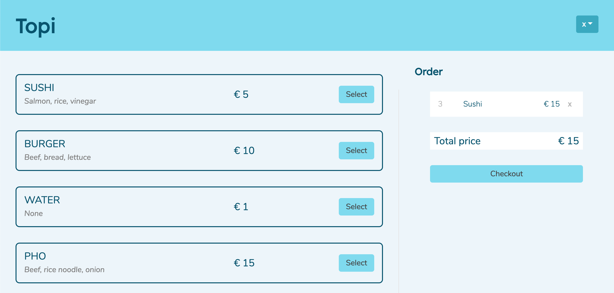
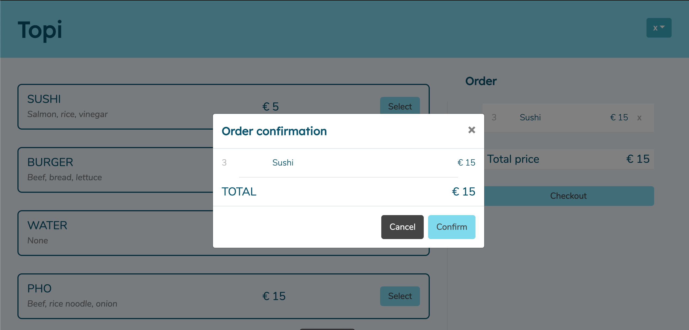
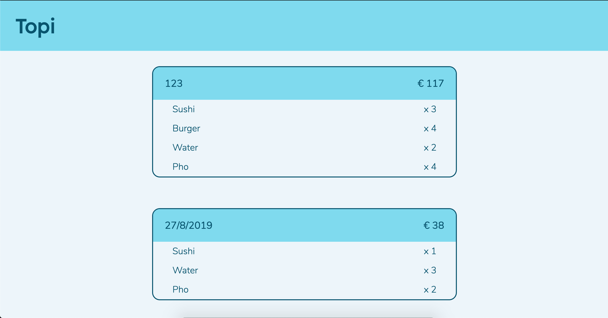

# JOURNAL
### Description
A dynamic progressive web application for personal online food service.
### Features
- Authentication
- Choose and add food items to your basket
- Checkout and upload food orders.
- View purchase history
### Technologies and language
 - React and Javascript
 - React Hooks, Context and Router.
 - Firebase for backend storage and database
 - Styling with conventional CSS with a few exception of Bootstrap.
### Screenshots
**Login Component**
<br/>

**Home Component**
<br/>

**Checkout Component**
<br/>

**History Component**
<br/>


### Install
 - Clone from github
 - Open with code editor (my choice is Atom)
 - **Important:** *Firebase require personal authentication tokens and keys for usage*
 - Run app with npm start or yarn start
 
### Code snippets:
**"Post" entity for Room SQL**
``` jsx
    const AuthContext = React.createContext();

    const AuthProvider = (props) => {
      const [state, dispatch] = React.useReducer(AuthReducer, authInitialState);
      const value = {state, dispatch};

      return <AuthContext.Provider value={value}>{props.children}</AuthContext.Provider>;
    }

    const AuthConsumer = AuthContext.Consumer;
    export {AuthProvider, AuthConsumer, AuthContext};
```
**Request location permission**
``` jsx
    const History = () => {
    const { state, dispatch } = useContext(UserOrdersContext);

    useEffect(() => {
      getUserOrder((action) => {
        dispatch(action);
      })
    },[dispatch])

    const renderHistory = () => {
      const { userOrders } = state;
      return userOrders.map(item => {
        return(
          <SinglePastOrder key={item.key} item={item}/>
        )
      })
    }

    return(
      <>
        <Header title='Topi'/>
        <div className={styles.mainBody}>
        {(state.userOrders.length > 0 ) ? (
          <>
            {renderHistory()}
          </>
        ) : (
          <p>Nothing to see here s</p>
        )}
        </div>
        <Footer />
      </>
    );
  };
```
### Contributor
 - Thanh Tran (congthanhptnk)
